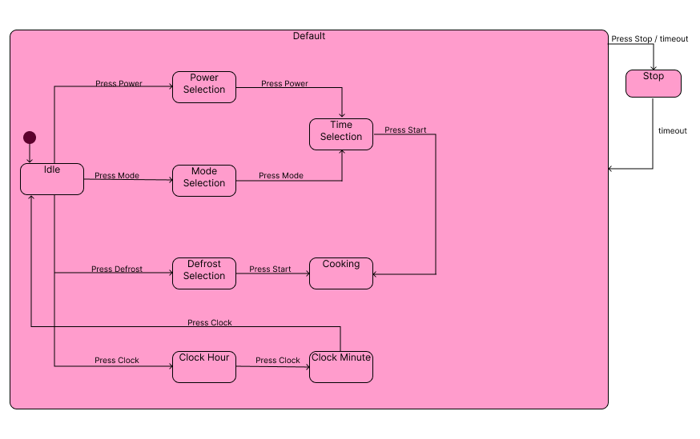
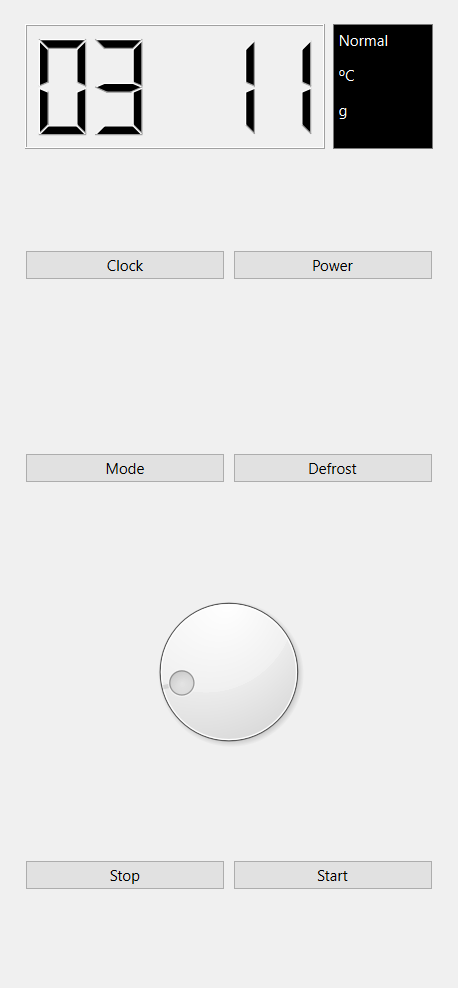

# Microwave-Oven

## Description
This is a Pratical Project for the IGR203 Software Development course of Telecom Paris. We were asked to implement the Mircrowave Oven of the professor Eric Lecolinet using concepts of Human-Computer-Interaction and State Machines so he can cook his foods and pop some popcorn. 

The Microwave simulator was implemented using C++ and the Qt Graphical interface.

We were asked to implement the following functionalities:
* Clock: Sets the hours (by clicking once), then the minutes (by clicking again), a third click validates.
* Power: Adjusts the power, from 0 to 100% (first click), then the cooking duration (second click). The oven can then be started by clicking on Start.
* Mode: Sets the mode: microwave, grill, microwave+grill (first click), then the cooking duration (second click). The oven can then be started by clicking on Start.
* Defrost: Adjusts the cooking duration according to the weight of the food to be defrosted. The oven can then be started by clicking on Start.
* Dial: Rotary knob that allows choosing a value. This value depends on the selected state (e.g. when setting the hour, it changes the hour, when setting the minutes, it changes the minutes, etc.)
* Start: Starts cooking.
* Stop: Stops cooking or cancels any operation.

I've implemented each functionality with a button, used QTDial to create the dial, and used QLCDNumber to create the screen panel.

## State Machine

This programs implements a State Machine with the states needed for implementing the features asked:

* Idle: Initial state, nothing is happening, the dial is deactivated and the screen shows the clock.
* Power Selection: Here we can set the percentage of the power using the dial, from 0 to 100%, the screen shows the power. If we click power button again we go to Time Selection state.
* Mode Selection: Here we can set the mode A, B or C, the dial is used to select the mode. If we click mode button again we go to time Selection state.
* Time Selection: Here we can set the cooking time using the dial. If we click the start button, we enter the cooking state. 
* Defrost Selection: Here we need to set the weight of the food we want to defrost and press start, the time of cooking will be automatically calculated and the program enters cooking state.
* Cooking: Here the screen shows a countdown with the time chosen and the dial is deactivated. In the end of the countdown we enter in Stop State
* Default State: This state is the State father of all the states above.
* Stop: This State serves as a transition for the Idle State. We enter it, if we press the stop button or if the countdown of cooking state ends. We leave the Stop State after a countdown of 2 seconds.
         
## Results

I've used 2 main classes, the [mainwindow class](mainwindow.h) where we implemented all the UI, the buttons and the state machine, and the [panel class](panel.h) where we implemented the screen and how it would show the information. I've also used a function of [transition.h](transition.h) given in class to implement an action in the transition. I've implemented all the parts asked by the assignment and it is working as described above with a simple but not confusing design.

## Improvements 

I could still improve the project by given some color to the design and separating the State Machine in a different class.
To improve even futher 
